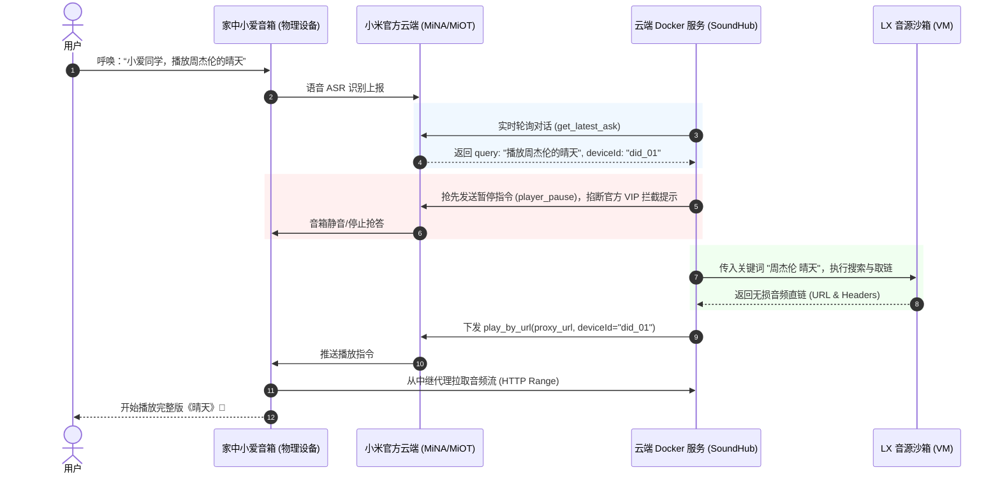
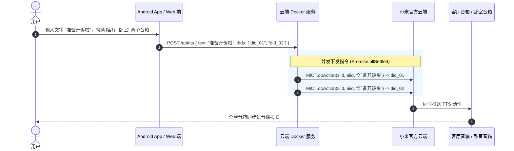

# XiaoAi SoundHub (小爱声枢) 架构设计与技术全景

> 面向个人用户的小爱音箱全网音乐播放、实体语音点歌拦截与多设备 TTS 智能控制系统。

---

## 一、 系统架构总览

整个系统由 **云端 Docker 服务中枢 (Server)**、**Android App 客户端 (Mobile)**、**Web 端管理台 (Web)** 以及 **家庭小爱音箱集群** 组成：

```
┌─────────────────────────────────────────────────────────────────────────┐
│                    客户端层 (Client Layer)                              │
│                                                                         │
│   ┌───────────────────────────────────┐  ┌──────────────────────────┐  │
│   │    Android App (lx-music-mobile)  │  │   Web 控制端 (Browser)   │  │
│   │  • 全网音乐搜索 & 歌词/封面       │  │  • 纯浏览器免安装点播    │  │
│   │  • 小爱音箱投播选择器 (单选/多选)  │  │  • 多音箱状态监控        │  │
│   │  • 多音箱文本语音 (TTS) 广播面板  │  │  • 多音箱一键 TTS 播报   │  │
│   └─────────────────┬─────────────────┘  └────────────┬─────────────┘  │
└─────────────────────┼─────────────────────────────────┼─────────────────┘
                      │ (HTTPS REST API / WebSocket)    │
                      ▼                                 ▼
┌─────────────────────────────────────────────────────────────────────────┐
│                云服务器 Docker 容器中枢 (XiaoAi SoundHub Server)         │
│                                                                         │
│  ┌───────────────────────────────────────────────────────────────────┐  │
│  │ 1. 小爱音箱核心控制网关 (Speaker Gateway)                         │  │
│  │    • 基于小米云端 MiNA / MiOT 协议 (通过 userId + passToken 登录) │  │
│  │    • 设备列表自动发现与多设备 DID 路由 (客厅/卧室/书房)            │  │
│  │    • MiOT 动作指令自动映射 (如 [5,1], [7,3] 等各机型 TTS 兼容)    │  │
│  │    • 多音箱并发广播 (Promise.all 并行下发)                        │  │
│  └───────────────────────────────────────────────────────────────────┘  │
│  ┌───────────────────────────────────────────────────────────────────┐  │
│  │ 2. 实体音箱语音对话监听器 (Conversation Listener)                 │  │
│  │    • 长轮询 MiNA 对话日志 (get_latest_ask)                        │  │
│  │    • 毫秒级捕获实体音箱指令 (例如：“小爱同学，播放周杰伦的晴天”) │  │
│  │    • 抢先调用 player_pause 掐断官方 VIP / 试听限制提示             │  │
│  └───────────────────────────────────────────────────────────────────┘  │
│  ┌───────────────────────────────────────────────────────────────────┐  │
│  │ 3. LX Music 自定义音源沙箱引擎 (Source Sandbox Engine)             │  │
│  │    • 基于 Node.js VM 沙箱直接执行用户的稳定 LX 自定义 JS 脚本      │  │
│  │    • 模拟 lx.request、crypto、Buffer 等标准环境                   │  │
│  │    • 执行全网搜歌、精准取链 (支持 128k/320k/flac 无损音质)        │  │
│  └───────────────────────────────────────────────────────────────────┘  │
│  ┌───────────────────────────────────────────────────────────────────┐  │
│  │ 4. 防盗链音频流中继代理 (Stream Proxy)                             │  │
│  │    • 针对有 Referer / User-Agent 防盗链限制的音乐直链提供中继    │  │
│  │    • 支持 HTTP Range 分片流，确保小爱音箱 100% 顺畅拉流           │  │
│  └───────────────────────────────────────────────────────────────────┘  │
│  ┌───────────────────────────────────────────────────────────────────┐  │
│  │ 5. 播放队列与自动切歌调度器 (Queue & Autoplay Scheduler)           │  │
│  │    • 根据歌曲时长自动计算播放结束时间                             │  │
│  │    • 在当前歌曲结束前 5 秒预解析下一首直链，实现无缝连续播放      │  │
│  └───────────────────────────────────────────────────────────────────┘  │
└─────────────────────────────────────┬───────────────────────────────────┘
                                      │ (小米云 Push / 音箱拉流)
                                      ▼
┌─────────────────────────────────────────────────────────────────────────┐
│                     家庭端：小爱音箱集群 (免刷机)                       │
│                                                                         │
│      ┌───────────────┐      ┌───────────────┐      ┌───────────────┐    │
│      │  客厅小爱 Pro │      │  卧室小爱Play │      │  书房小爱Sound│    │
│      └───────────────┘      └───────────────┘      └───────────────┘    │
└─────────────────────────────────────────────────────────────────────────┘
```

---

## 二、 核心工作流程与时序

### 1. 实体小爱音箱语音点歌（“小爱同学，播放周杰伦”）



---

### 2. 多音箱文本语音广播 (TTS)



---

## 三、 模块详细设计

### 1. 云端 Docker 服务 (`server/`)
- **语言与框架**：TypeScript + Node.js (Express / Fastify)
- **核心文件分布**：
  - `src/speaker/client.ts`：小米认证、会话维护、设备列表获取、MiNA 与 MiOT 动作封装。
  - `src/speaker/model_map.ts`：各型号音箱的 TTS 指令映射表（如 `oh2p:[7,3]`, `lx04:[5,1]`, `l05b:[5,3]`）。
  - `src/listener/conversation.ts`：对话监听轮询器，定时拉取最新提问并触发回调。
  - `src/listener/parser.ts`：口令正则解析器，提取歌名、歌手名、控制指令。
  - `src/source_engine/runner.ts`：LX Music JS 脚本执行沙箱，对外暴露 `search(keyword)` 和 `getUrl(songId, quality)`。
  - `src/proxy/stream.ts`：音频流中继器，转发分片并自动添加防盗链 Headers。
  - `src/server.ts`：RESTful API 路由及静态 Web 托管。

### 2. 移动端 Android App (`app/`)
- **基础框架**：基于 `lx-music-mobile`（React Native + TypeScript）
- **新增模块**：
  - `src/components/XiaoAiCastBar/`：小爱投播栏组件，展示当前连接的音箱状态，支持快速切换输出设备。
  - `src/components/XiaoAiTTSModal/`：多音箱 TTS 广播弹窗，支持预设常用语、单选/多选音箱、音量滑块调节。
  - `src/services/xiaoaiApi.ts`：封装与云端 Server 的 RESTful API 交互逻辑。
- **CI/CD 构建**：
  - `.github/workflows/release.yml`：基于 GitHub Actions 自动化编译输出 APK。

---

## 四、 接口规范简述 (Server API)

| 方法 | 路由 | 描述 | 请求参数 / Body |
| :--- | :--- | :--- | :--- |
| `GET` | `/api/devices` | 获取当前小米账号下所有音箱设备列表 | - |
| `POST` | `/api/tts` | 向指定一个或多个音箱发送语音播报 | `{ "text": "...", "dids": ["did_1", "did_2"] }` |
| `POST` | `/api/play` | 命令指定音箱播放指定 URL 歌曲 | `{ "url": "...", "name": "...", "did": "did_1" }` |
| `POST` | `/api/control` | 播放控制（暂停/继续/上一首/下一首/音量） | `{ "action": "pause/resume/next/prev/volume", "value": 30, "did": "..." }` |
| `GET` | `/api/search` | 调用云端 LX 音源进行歌曲搜索 | `?keyword=周杰伦&page=1` |
| `GET` | `/api/url` | 获取指定歌曲的播放直链 | `?songId=xxx&quality=320k` |
| `GET` | `/proxy/stream` | 音频流中继代理（给小爱音箱拉流） | `?url=encoded_url&headers=encoded_headers` |
| `GET` | `/api/status` | 获取服务运行状态与当前播放信息 | - |

