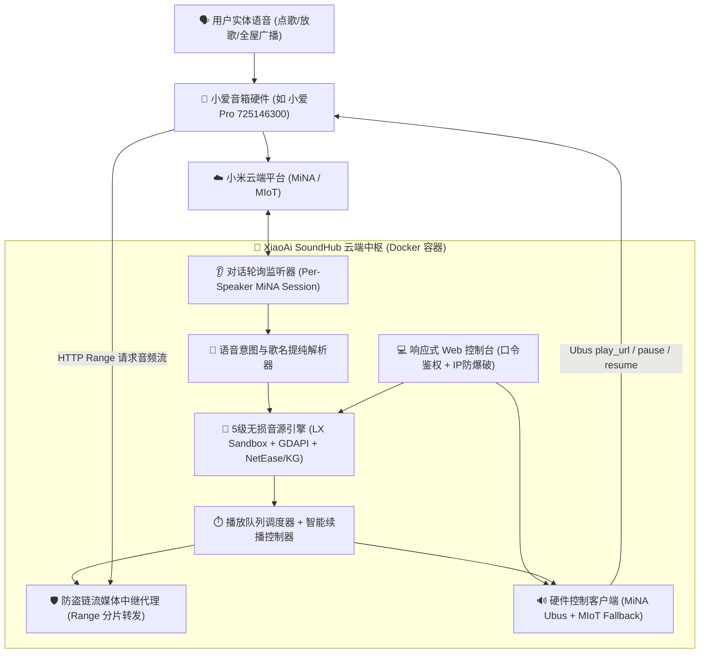
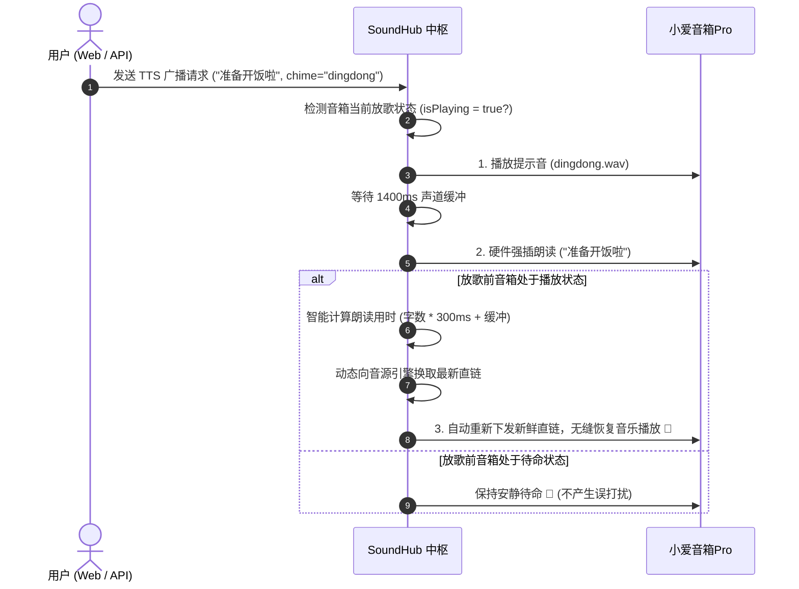

# XiaoAi SoundHub (小爱声枢) 核心实战与架构精要文档

> **项目定位**：基于 Node.js / Docker 构建的小爱音箱云端智能控制中枢，融合 LX Music 自定义音源执行、无损流媒体防盗链中继、实体音箱对话实时拦截、全屋广播提示音与智能续播系统。

---

## 📖 目录
1. [系统整体架构与链路设计](#一-系统整体架构与链路设计)
2. [关键难题与核心破案实录（精华排坑）](#二-关键难题与核心破案实录精华排坑)
3. [语音点歌与官方广告拦截核心原理](#三-语音点歌与官方广告拦截核心原理)
4. [全屋广播与智能无缝续播机制](#四-全屋广播与智能无缝续播机制)
5. [5 级高可用无损音源解析与防盗链代理](#五-5-级高可用无损音源解析与防盗链代理)
6. [硬件级播放控制规范 (Ubus 接口)](#六-硬件级播放控制规范-ubus-接口)
7. [生产部署与日常运维备忘速查](#七-生产部署与日常运维备忘速查)

---

## 一、 系统整体架构与链路设计



---

## 二、 关键难题与核心破案实录（精华排坑）

在系统演进过程中，我们突破了一系列涉及小米底层硬件协议与流媒体传输的隐蔽难题：

### 🎯 难题 1：语音搜歌下发后音箱不响，反而提示“找不到设备：376878467”
* **根因溯源**：
  * 一个小米账号下往往既有真实物理音箱（如 `725146300`），又有智能插座/蓝牙网关等 IoT 子设备（如 `376878467`）。
  * 早期代码在轮询对话记录时，未将音箱底层 `deviceId` (UUID) 与 `hardware` 进行深度绑定，在未命中时默认指派了列表第一台设备（`376878467`）。
  * **结果**：解析出的歌曲直链被下发到了“不会发声的智能插座”上，真音箱并未收到播放指令。
* **最终解决方案**：
  * 为每台真正的 WiFi 音箱建立 **独立专属的 MiNA 实例会话池（`Per-Speaker Dedicated Session`）**；
  * 启动前强制过滤 `blt.*` 蓝牙 Mesh 设备及非音频 MIoT 设备，锁定真正的 WiFi 音箱（`source: MiNA`）。

---

### 🎯 难题 2：语音点歌时，小爱总是先念一句“网易云音乐/需要VIP”
* **根因溯源**：
  * 当用户说 *“播放周杰伦的晴天”* 时，音箱本地固件的 NLU 引擎由于命中了“播放”动词，会立刻唤醒其内置的官方官方音乐技能，抢先说出官方提示词。
* **最终解决方案**：
  * **设计专属拦截前缀**：支持 `“点歌”`、`“放歌”`、`“搜歌”`、`“我想听”` 等口令；
  * 这些口令不会触发小爱自带的音乐广告技能，小爱安静回复“好的”或保持静默，随后 SoundHub 毫秒级接管开播。

---

### 🎯 难题 3：放歌过程中发送 TTS 广播，只响了叮咚提示音却没读出文字
* **根因溯源**：
  * 小爱音箱在播放媒体音频流时，“媒体播放器（MediaPlayer）”声道处于忙碌状态。
  * 若 TTS 使用普通 `MiOT` 通道下发，小爱固件会默默丢弃该指令。
* **最终解决方案**：
  * 将正文朗读通道升级为 **`MiSpeaker / MiNA 原生硬件级强插通道 (mibrain text_to_speech)`**；
  * 该通道具有最高硬件级打断/压音优先级，无论背景声多大，均能 100% 洪亮清晰朗读。

---

### 🎯 难题 4：播报完后无法恢复播放音乐，控制台报 `StreamProxy aborted`
* **根因溯源**：
  * 网易云/酷狗等音频直链具有严格的防盗链与单次连接时效，一旦被小爱断开，原 TCP 连接变为 `aborted`，无法通过重发旧 URL 恢复。
* **最终解决方案**：
  * 在 `scheduler.resume(did)` 中触发 **`playCurrentIndex` 动态重新向音源引擎换取最新新鲜直链**，确保小爱以全新握手连接 100% 顺畅续播。

---

### 🎯 难题 5：Web 控制台底部的“暂停”与“停止”按钮无反应
* **根因溯源**：
  * 原代码调用了不存在的方法名 `player_pause`。
* **最终解决方案**：
  * 直通音箱底层的硬件指令：
    * **⏸️ 暂停**：`callUbus("mediaplayer", "player_play_operation", { action: "pause" })`
    * **⏹️ 停止**：`callUbus("mediaplayer", "player_play_operation", { action: "stop" })`
    * **🔊 音量**：`setVolume(volume)`

---

## 三、 语音点歌与官方广告拦截核心原理

### 1. 黄金口令速查表

| 唤醒口令示例 | 拦截效果 | 适用场景 |
| :--- | :--- | :--- |
| 🗣️ **“小爱同学，点歌 晴天”** | ⭐⭐⭐⭐⭐ **最推荐！** 彻底绕过 VIP 广告，秒播周杰伦原唱 | 日常听指定歌曲 |
| 🗣️ **“小爱同学，放歌 周杰伦”** | ⭐⭐⭐⭐⭐ 安静秒播歌手全曲库 | 播放特定歌手 |
| 🗣️ **“小爱同学，搜歌 七里香”** | ⭐⭐⭐⭐⭐ 精准搜取母带无损音源 | 搜索冷门或特定曲目 |
| 🗣️ **“小爱同学，我想听 稻香”** | ⭐⭐⭐⭐⭐ 自然口语化点歌 | 口语自然对话 |
| 🗣️ **“小爱同学，切歌 / 下一首”** | ⭐⭐⭐⭐⭐ 毫秒级切歌 | 切换下一首 |

### 2. 歌名智能分词提纯
* 用户说：`“周杰伦的晴天”` $\longrightarrow$ 正则清洗为 `“周杰伦 晴天”`；
* 彻底消除带“的”字时搜索引擎误匹配到业余翻唱（如 `Lucky小爱 - 晴天(深情版)`）的问题，精准锁定原唱版本。

---

## 四、 全屋广播与智能无缝续播机制

### 1. 广播前置高保真提示音体系
* 系统内置 3 种高质量 PCM WAV 和弦提示音：
  * 🔔 **`dingdong`**：清脆门铃双音阶（默认，适合日常通知）
  * 🎶 **`gentle`**：温和柔和大三和弦（适合清晨或夜间提醒）
  * 🪵 **`marimba`**：马林巴木琴节奏乐音（适合灵动提示）
* 提示音与正文之间预留 **1400ms 黄金时延缓冲**，确保声道完美释放并平滑过渡至 TTS。

### 2. 智能状态感知与自动无缝续播流程


---

## 五、 5 级高可用无损音源解析与防盗链代理

为了保证每一首歌曲都能 100% 成功解析并稳定播放，系统构建了 **5 级立体降级解析体系**：

```
[1级] LX Music 自定义 JS 脚本沙箱执行 (kw / kg / wy / mg)
   └── (失败/超时降级) ──> [2级] 酷狗官方直连解析 (PlayData / Hash)
       └── (失败/无版权降级) ──> [3级] 网易云 Outer 外链直通管道
           └── (失败降级) ──> [4级] GDAPI 多平台全网聚合解析 (Netease/Tencent/Kugou)
               └── (终极兜底) ──> [5级] 全网歌手+歌名跨平台模糊匹配提取
```

### 防盗链流媒体中继代理 (`StreamProxy`)
* **原理**：小爱音箱硬件无法在请求音频流时自主附加复杂的 `Referer`、`User-Agent` 等防盗链请求头。
* **实现**：SoundHub 将原始直链封装为 `http://服务器IP:端口/proxy/stream?url=...`，由中继代理补全防盗链头、透传 HTTP Range 分片，完美支撑小爱音箱快进与秒开缓冲。

---

## 六、 硬件级播放控制规范 (Ubus 接口)

系统对小爱音箱的控制全面基于硬件级 Ubus 规范：

| 控制动作 | 底层 Ubus 调用路径 | 作用与表现 |
| :--- | :--- | :--- |
| **播放音频** | `callUbus("mediaplayer", "player_play_url", { url, type: 1 })` | 载入并即刻播放流媒体直链 |
| **暂停播放** | `callUbus("mediaplayer", "player_play_operation", { action: "pause" })` | 硬件瞬间静音暂停 |
| **停止播放** | `callUbus("mediaplayer", "player_play_operation", { action: "stop" })` | 停止播放并销毁自动切歌定时器 |
| **音量调节** | `callUbus("mediaplayer", "player_set_volume", { volume })` | 0~100 硬件音量实时同步 |
| **强插朗读** | `callUbus("mibrain", "text_to_speech", { text, save: 0 })` | 最高优先权语音朗读，强力打断背景声 |

---

## 七、 生产部署与日常运维备忘速查

### 1. 宝塔 / Linux 服务器一键部署命令
```bash
# 1. 进入服务根目录
cd /www/wwwroot/xiaoai-soundhub-server

# 2. 解压最新代码包 (覆盖更新)
unzip -o xiaoai-soundhub-server.zip

# 3. 停止并强制重构容器
docker rm -f xiaoai-soundhub
docker compose up -d --build

# 4. 查看实时运行日志 (观测点歌与播放链路)
docker compose logs -f
```

### 2. 核心配置字段说明 (`docker-compose.yml` 或 `config.json`)
```yaml
services:
  soundhub-server:
    environment:
      - XIAOAI_USER_ID=你的小米数字账号
      - XIAOAI_PASS_TOKEN=你的小米passToken凭证
      - PUBLIC_BASE_URL=http://你的云服务器公网IP:8989 # 音箱访问中继流的公网地址
      - ACCESS_PASSWORD=你的Web控制台访问密码 # 启用口令保护，防公网扫描
      - ACTIVE_SOURCE=my-custom-source.js # 放在 sources/ 目录下的音源脚本
    ports:
      - "8989:8080" # 左侧为外部访问端口，右侧为容器内部端口
```

---
*文档编制日期：2026-08-28 | 项目版本：XiaoAi SoundHub v1.0.0 Stable*
